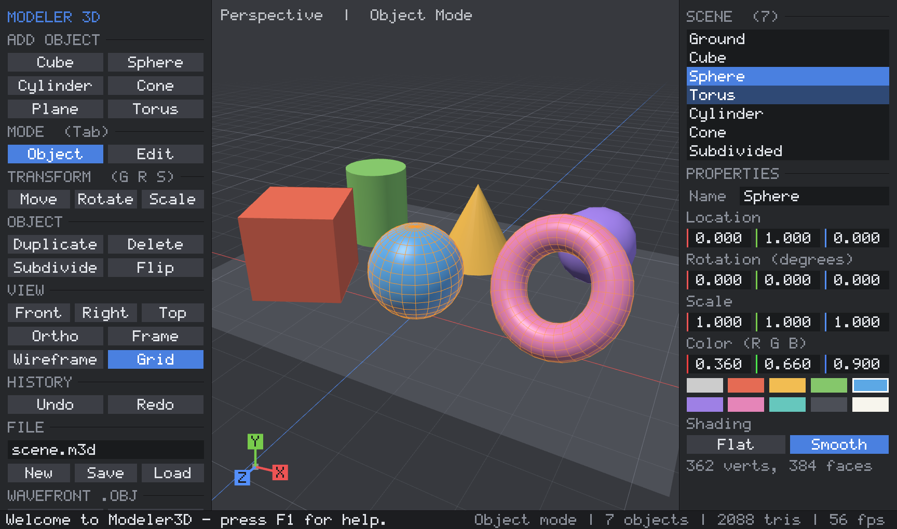

# Modeler3D

A small 3D modeling program written in C++17 and OpenGL 3.3. It runs on Windows and Linux,
has **no third-party dependencies**, and builds into a single executable you can just run.



## Run it

| OS      | File                         | How                                              |
|---------|------------------------------|--------------------------------------------------|
| Windows | `dist/windows/Modeler3D.exe` | Double-click it. No installer, no DLLs.          |
| Linux   | `dist/linux/Modeler3D`       | `./Modeler3D` (needs X11 + an OpenGL 3.3 driver). |

You can also pass a file to open: `Modeler3D chair.m3d` or `Modeler3D model.obj`.

> The prebuilt Linux binary was built on Ubuntu 26.04, so it needs a recent glibc (2.43+).
> On older distributions, build it yourself with `./build_linux.sh`. It takes about 20 seconds.

## What it can do

- **Primitives**: cube, UV sphere, cylinder, cone, plane, torus
- **Object mode**: select (click, Shift+click, box), move / rotate / scale with axis locks and snapping,
  duplicate, delete, rename, numeric location / rotation / scale, colors, flat or smooth shading
- **Edit mode** (vertex editing): select vertices (click or box), move / rotate / scale them,
  **extrude** faces, delete vertices, edit the selection's median position numerically
- **Catmull-Clark subdivision** and **flip normals**
- **Undo / redo** (64 steps) for every edit
- **Save / load** scenes (`.m3d` text format, keeps transforms and quads/n-gons)
- **Export / import Wavefront OBJ** (+ `.mtl` with object colors), usable in Blender, Unity, Godot, etc.
- Perspective / orthographic camera, front / right / top views, wireframe overlay, grid,
  orientation gizmo, F12 screenshots, warning before quitting with unsaved changes

## Controls

| Input                          | Action                                               |
|--------------------------------|------------------------------------------------------|
| Left click / drag              | Select / box select (Shift adds, Ctrl removes)       |
| Right or middle drag           | Orbit camera (also Alt + left drag)                  |
| Shift + right drag             | Pan camera                                           |
| Wheel                          | Zoom                                                 |
| `G` / `R` / `S`                | Move / rotate / scale, then `X` `Y` `Z` to lock an axis, hold `Ctrl` to snap, click or Enter to confirm, right click or Esc to cancel |
| `Tab`                          | Toggle Object / Edit mode                            |
| `A`                            | Select all / none                                    |
| `E`                            | Extrude selected faces (Edit mode)                   |
| `Shift+D`                      | Duplicate                                            |
| `X` / `Delete`                 | Delete                                               |
| `F`                            | Frame selection                                      |
| `1` `3` `7` (Ctrl = opposite)  | Front / right / top view                             |
| `5`                            | Perspective / orthographic                           |
| `W`                            | Wireframe overlay + x-ray vertex picking             |
| `Ctrl+Z` / `Ctrl+Y`            | Undo / redo                                          |
| `Ctrl+S` / `Ctrl+O`            | Save / load the file named in the FILE box           |
| `F12`                          | Save a PNG screenshot                                |
| `F1` / `H`                     | Help overlay                                         |

Number fields in the right panel: drag sideways to change them (Shift for fine steps), or click
to type a value.

## Building from source

**Windows:** run `build_windows.bat`. It uses CLion's bundled MinGW / CMake / Ninja if CLion is
installed, or any CMake + MinGW-w64 / Visual Studio on the PATH. The result is
`dist\windows\Modeler3D.exe`, statically linked so it only depends on DLLs that ship with Windows.
The project also opens directly in CLion (`CMakeLists.txt`); pick the `Modeler3D` target.

**Linux:** install a compiler, CMake and the X11/OpenGL headers
(`sudo apt install build-essential cmake libx11-dev libgl-dev` on Debian/Ubuntu), then run
`./build_linux.sh`. The result is `dist/linux/Modeler3D`.

**Tests:** configure with `-DMODELER_BUILD_TESTS=ON` and run `modeler_tests`. It covers
470 checks on math, primitives (closed and consistently oriented), Catmull-Clark,
extrude/delete, ray picking and file round trips.

## How the code maps to the Engine Books

| Topic | Code | Reference |
|---|---|---|
| Vectors, matrices, TRS transforms, Euler angles, inverse | `src/math3d.h` | *Fundamentals of Computer Graphics* 5e ch. 2, 6, 7; *Game Engine Architecture* Vol. I ch. 5 |
| Camera, perspective / orthographic projection | `math3d.h`, `Camera` in `editor.cpp` | FoCG ch. 8 |
| Ray picking (unproject + ray/triangle) | `Editor::viewRay`, `raycastMesh`, `pickObject` | FoCG ch. 4 |
| Blinn-Phong shading, key/fill/ambient lights | shaders in `renderer.cpp` | FoCG ch. 5; GEA Vol. II ch. 12 |
| GPU pipeline, vertex buffers, per-object mesh cache | `renderer.cpp` | FoCG ch. 9, 17; GEA Vol. II sec. 11.4 |
| Indexed polygon meshes, subdivision, extrude | `mesh.cpp` | FoCG sec. 12.1 |
| Scene / object model, world editor | `scene.cpp`, `editor.cpp` | FoCG sec. 12.2; GEA Vol. II ch. 16 (game world editor) |
| Platform layer (Win32/WGL, X11/GLX) | `platform_*.cpp` | GEA Vol. I sec. 1.5 |
| Input: per-frame pressed / held / released state | `platform.h` | GEA Vol. I ch. 9 (Human Interface Devices) |
| Main loop, startup / shutdown order, frame timing | `main.cpp` | GEA Vol. I sec. 6.1, ch. 8 |
| Immediate-mode UI, in-tool menus, debug overlays | `ui.cpp` | GEA Vol. I ch. 10; GEA Vol. II sec. 12.8 |
| Asset I/O (scene + OBJ) | `scene.cpp` | GEA Vol. I ch. 7 |

## Project layout

```
CMakeLists.txt        build definition (Windows: WIN32 GUI exe, static runtime; Linux: X11 + libGL)
build_windows.bat     one-click Windows build -> dist/windows/
build_linux.sh        one-command Linux build -> dist/linux/
src/
  main.cpp            entry point + main loop
  platform.h          window/input abstraction; platform_win32.cpp, platform_x11.cpp
  gl.h / gl.cpp       minimal OpenGL 3.3 function loader (no GLAD/GLEW)
  math3d.h            vector/matrix math
  mesh.*              mesh data, primitives, Catmull-Clark, extrude, ray casting
  scene.*             objects, picking, .m3d and .obj file I/O
  renderer.*          shaders, GPU buffers, drawing
  ui.*, font.*        immediate-mode GUI + built-in bitmap font
  editor.*            the modeling application (tools, undo, panels)
  image_io.*          PNG writer for screenshots
tests/tests.cpp       unit tests
```
