# Modeler3D

A small 3D modeling program written in C++17 and OpenGL 3.3. It runs on Windows and Linux,
has **no third-party dependencies**, and builds into a single executable you can just run.

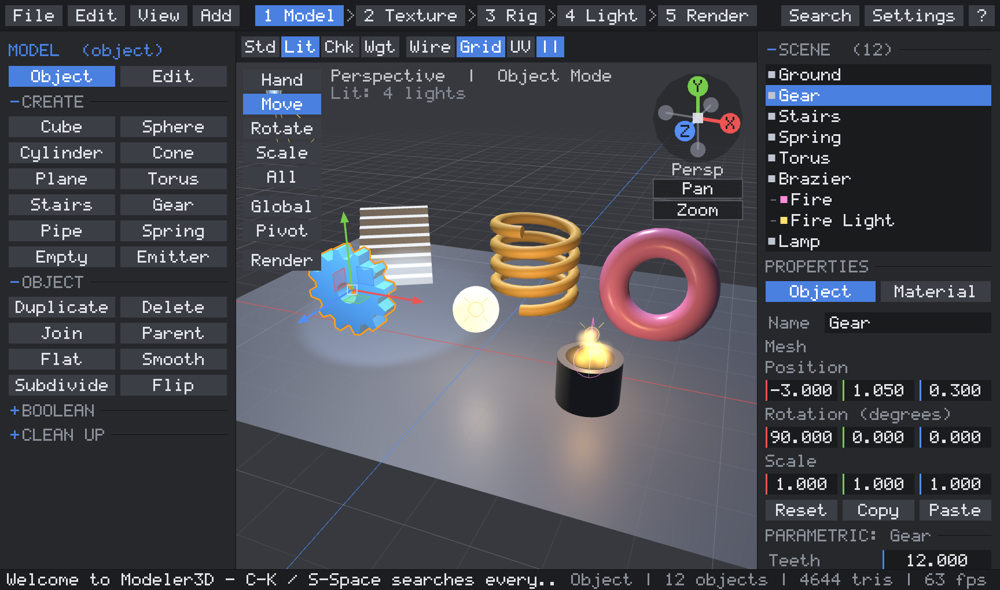

*Showcase scene, `Modeler3D --demo 1`. More screenshots are in [Screenshots](#screenshots) below.*

## Run it

| OS      | File                         | How                                              |
|---------|------------------------------|--------------------------------------------------|
| Windows | `dist/windows/Modeler3D.exe` | Double-click it. No installer, no DLLs.          |
| Linux   | `dist/linux/Modeler3D`       | `./Modeler3D` (needs X11 + an OpenGL 3.3 driver). |

You can also pass a file to open: `Modeler3D chair.m3d` or `Modeler3D model.obj`.

> The prebuilt Linux binary was built on Ubuntu 26.04, so it needs a recent glibc (2.43+).
> On older distributions, build it yourself with `./build_linux.sh`. It takes about 20 seconds.

## What it can do

**The interface follows the modeling pipeline.** The top bar holds the menus (File, Edit, View, Add)
and five workspaces in pipeline order: **1 Model > 2 Texture > 3 Rig > 4 Light > 5 Render**
(`Alt+1` .. `Alt+5`). Each workspace's left panel shows only the tools for that stage, in collapsible
sections, and switches the viewport to fit (Texture opens the UV editor, Light uses the Lit view,
Render starts the path tracer). The right panel is the scene list plus Properties in tabs (Object, and
Material / Light / Camera / Particles depending on the object). Every button has a tooltip with its
shortcut, and **every command is in the command palette** (`Ctrl+K` or `Shift+Space`: type a few
letters, Enter runs it).

**Modeling**
- **Parametric shapes**: cube, sphere, cylinder, cone/frustum, plane, torus, stairs, gear, pipe and
  spring. Every shape keeps its recipe, so you can change radius, segments, teeth, coils and so on at
  any time, plus a non-destructive modifier stack (subdivision levels, twist, taper). *Bake* turns the
  shape into a plain mesh; entering Edit mode bakes automatically (undo restores the recipe).
- **Object mode**: select (click, Shift+click, box), move / rotate / scale with axis locks and
  snapping, duplicate, delete, rename, and numeric location / rotation / scale.
- **Hierarchy multi-select**: Ctrl+click toggles an object, Shift+click selects the range from the
  last clicked row, and Ctrl+Shift+click adds a range.
- **Edit mode** with **vertex, edge and face selection** (`1` `2` `3` or the *Mesh* tab): click, box
  and Shift-add selection in each mode, with hidden edges and faces excluded. Move / rotate / scale
  the selection, edit the median numerically, delete, **Catmull-Clark subdivision** and **flip normals**.
- **Extrude** faces, or **extrude edges** (`Ctrl+E` in edge mode, or Shift + drag a Move handle): each
  boundary edge grows a new quad that continues the face it belongs to.
- **Inset faces** (`I`, then move the mouse; click or Enter confirms, Esc cancels): the *Last op* panel
  then adjusts it, with **Width**, **Depth** (negative pushes the inset in, positive pulls it out),
  **Dish** (lifts or sinks the centre for a concave or convex cap) and **Individual faces** (inset each
  face on its own instead of the whole region). The inset keeps a constant width along the region's
  border.
- **Type into any number field**: click it (or Tab to the next field) and type a value or an
  expression such as `2*pi`, `1/3`, `(4+2)^2` or a relative change: `+=0.5`, `*=2`. Caret, Home/End,
  Ctrl+A and Backspace/Delete work as usual. Dragging sideways still works too. Results that are not a
  number (`1/0`, `0/0`) are rejected.
- **Adding vertices**: **Loop cut** (`Ctrl+R`: a new edge loop across the edge under the mouse, any
  number of cuts), **Subdivide edges** (split the selected edges; faces with two cut edges are split
  across, a face with every edge cut becomes quads), **Connect** (`J`: split faces between selected
  vertices) and **Poke** (a centre vertex per face, raised or sunk).
- **Adding faces**: **Bevel** (`Ctrl+B`: edges, or corners in vertex mode; the mouse sets the width,
  the wheel the segments; *Profile* goes from a flat chamfer through round to the original corner),
  **Bridge** (`Alt+B`: two edge loops become a tube; two groups of faces become a tunnel between them,
  with segments and twist; works across separate pieces, e.g. after **Join** `Ctrl+J`) and **Fill**
  (`Alt+F`: a face across a border loop).
- **Push through** (`Alt+E`): punches the selected faces through to the other side of the shape: the
  opposite face gets a matching hole and a tunnel joins the two, like pushing a window through a wall.
  *Inset* in the Last operation panel leaves a frame around the hole; if both sides were already
  inset, the two insets are joined directly.
- **Merge** (`M`, to the centre) and **Collapse groups** (each connected group of selected vertices
  becomes one vertex).
- **Selection tools**: **edge loop** (double-click an edge), **edge ring**, **select more / less**
  (`Ctrl+=` / `Ctrl+-`), and `[` / `]` to step through objects from the keyboard.
- Every tool with settings becomes the **Last operation**: change a value in its panel and the tool
  runs again on the original mesh, as in Blender. All of them keep UVs and bone weights, and a closed
  mesh stays closed (checked by the unit tests with exact volumes, and by the stress test's fuzzer).

**Booleans and the n-gon solver** (*Mesh* tab)
- **Union / Difference / Intersection** of closed meshes, using BSP trees. Select the cutter mesh(es),
  then the target last; the target becomes the result in place, and the cutters are removed (or
  kept, with *Keep cut*). UVs are carried through the cuts, and it can be undone.
- The cut pieces are cleaned up automatically: vertices are welded, the **T-junctions** that
  splitting leaves are repaired (no cracks), and slivers are removed. With *Tris out* on, the
  result is triangulated.
- **N-gon solver** tools for any mesh: *Ngon>Tri* triangulates only faces with 5+ sides, *All>Tris*
  triangulates everything, *Clean up* runs the weld / T-junction / degenerate-face repair, and
  *Tri>Quad* merges coplanar triangle pairs back into quads.
- Triangulation is ear clipping, so concave n-gons (an L shape, a star, the cap of a cut) become
  correct triangles. The renderer uses it too, so concave faces display correctly.

**Hierarchy**
- **Drag and drop in the hierarchy**: drop a row onto another row to parent it, between rows to
  reorder (and adopt that row's parent), or below the list to unparent it. Works with several
  selected rows; dropping an object onto its own descendant is refused.
- Parent objects to each other (`Ctrl+P`, the last-clicked object becomes the parent) or clear the
  parent (`Alt+P`). Both keep each object where it is in the world.
- Children follow their parents: lights stuck to lamps, effects stuck to bones, groups under an
  **Empty**. The outliner shows the tree, and the viewport draws relationship lines.
- Deleting a parent hands its children to the grandparent. Duplicating keeps the links, and
  duplicating a whole rig remaps it to the copies.

**Lighting and materials**
- **Point, sun, spot and area lights** with color, intensity, range, cone angle and edge blend, plus a
  scene **ambient** color. Up to 8 lights are used in the **Lit** view. An **area light** is a
  one-sided rectangle (width x height) that gives soft shadows in the path tracer.
- **Color temperature**: switch a light to *Temperature* and set it in Kelvin (1000-40000 K), with
  presets for candle (1900 K), tungsten (3200 K), daylight (5600 K) and D65 (6500 K).
- **PBR materials** (metallic-roughness): base color, metallic, roughness, **emission**, and
  **transparency**: *Opacity* (alpha, see-through without refraction) and *Transmit* (glass, refracting
  with an index of refraction). Presets: Glass, Metal, Matte.
- **PBR texture maps**: Color, Normal, Roughness, Metallic, AO, Emission and Alpha slots. Each slot
  takes a file path (type it, use the file dialog, or **drag image files onto the window**; the
  filename decides the slot: `*_normal`, `*_rough`, `*_orm`/`*_arm` packed maps, and so on).
  *Folder...* loads a whole texture set from one folder. UV tiling and bumpiness are per material.
  PNG (all bit depths, interlaced), baseline JPEG, TGA and BMP load with the built-in decoders; three
  procedural sets (`builtin:bricks`, `builtin:tiles`, `builtin:metal`) need no files. The viewport
  shows normal maps and transparency; the path tracers use every map.

**Rendering (path tracing)** (*Render* tab, `F5`, or the *Render* button on the tool palette)
- A Monte Carlo **path tracer** shows the scene in the viewport and refines it progressively:
  soft shadows from every lamp, glossy reflections, emissive objects lighting their surroundings,
  multiple light bounces, and anti-aliasing.
- **Sampling controls**: samples per pixel (presets 16 / 64 / 256 / 1024, or any number; raising it
  continues a finished render), max bounces, resolution %, a firefly clamp, sky strength and soft
  shadow size.
- **Three devices**: *GPU* runs the tracer in a fragment shader (triangles, BVH and materials uploaded
  as float textures). *CPU* spreads tiles over every core. *RTX* uses **hardware ray tracing**
  (DirectX 12 DXR 1.1 inline ray queries, so RT cores on NVIDIA RTX / AMD RX 6000+ / Intel Arc)
  when a supported GPU is detected, and becomes the default device then. All three use the same
  materials and produce the same image. Without a DXR GPU the RTX button says why; *Software DXR*
  runs the same code on Microsoft's WARP software device for testing.
- **Render camera**: add a *Camera* object (Create tab) and render through it, with real camera
  settings: focal length and sensor width, **f-stop** (aperture size and **depth of field**, with a
  focus distance and polygonal aperture blades for the bokeh shape), **shutter speed** and **ISO**,
  plus exposure compensation. Exposure follows the photographic exposure equation (f/8, 1/125 s, ISO 100
  is the neutral setting). `0` looks through the camera, `Ctrl+Alt+0` moves it to the current view.
- **Glass and transparency** are path traced: rough or smooth refraction with Fresnel reflection,
  coloured transmission, and alpha-blended surfaces that let light and shadows through.
- *Live*: moving the camera or editing the scene restarts the render. *Save PNG* writes the image,
  plus a `.txt` with its timings. Scenes without lamps are lit like the Studio view. Emissive
  surfaces don't cast shadows, so a lamp inside a glowing shade still lights the room. Particles
  are not path traced.
- Command line: `Modeler3D --demo 6 --render out.png --device gpu --samples 256` renders and exits
  (`--device cpu|gpu|rtx`; `--rt-warp` allows the WARP software device for `rtx`).

**UVs**
- **Unwrap**: *Smart* (charts by face direction, packed without overlap), *Box*, *Planar*,
  *Cylindrical*, *Spherical*, *Per-face* (lightmap style). In Object mode it unwraps whole meshes;
  in Edit mode, only the selected faces.
- **Tools**: fit to 0-1, pack islands, rotate 90, flip U / V.
- A **UV editor** overlay shows the layout; drag selected faces in it to move their UVs.
- A **checker** view shows stretching and seams.
- UVs are stored per face corner, survive subdivision / extrude, and round-trip through `.m3d`
  and OBJ (`vt`).

**Bones and skinning**
- **Bones** are hierarchy objects: *Add Bone*, then *Extrude* to grow a chain from the tip.
- **Bind**: select the mesh and the root bone, then bind. The bind pose becomes the rest pose and
  weights are computed automatically (up to 4 bones per vertex).
- Pose by rotating bones (`R`). *Rest Pose* resets them.
- **Weights view** is a heat map of one bone's influence (select a bone, or pick it in
  Properties > Skin). In Edit mode you can **assign / remove** a weight on the selected vertices,
  **normalize**, or recompute automatic weights.

**Particles**
- **Emitters** with rate, lifetime, speed, spread cone, gravity, drag, start/end size and
  color, and spawn radius. *Glow* blends additively; *Smoke* is alpha-blended.
- They simulate live (Space plays / pauses) and are hierarchy objects, so you can parent fire to a
  torch or sparks to a bone.

**Unity-style transform tools**
- **Tools:** Hand / Move / Rotate / Scale / All (combined), on the palette at the left of the
  viewport or with `Q W E R Y`.
- **Handles you drag:**
  - Move: arrows (one axis), squares (two axes, on the camera-facing side), centre box (view plane).
  - Rotate: rings around each axis (only the front halves are drawn bright), an outer ring for the
    view axis, and trackball rotation from the inside.
  - Scale: cubes per axis and a centre box for uniform scale.
  - Hold `Ctrl` while dragging to snap.
- **Global / Local** orientation (`X`) and **Pivot / Center** handle position (`Z`), as in Unity. In
  Pivot mode, multiple objects rotate and scale around their own origins. The Scale handle always uses
  local axes.
- **Edit mode:** the same handles move vertices. Shift + drag on a Move handle **extrudes** the selected
  faces first (ProBuilder style).
- **Unity scene camera:**
  - Alt + left drag orbits, middle drag pans, Alt + right drag zooms, and the wheel zooms.
  - Hold the right button and use `W A S D Q E` to **fly**. It accelerates while held, Shift makes it
    faster, and scrolling while flying sets the fly speed.
  - Arrow keys move the camera.
  - The **scene gizmo** in the top-right corner works like Unity's: click an axis to look along it
    (switches to Iso), and click the centre or the Persp/Iso label to toggle projection.
  - `F`, the view buttons and **double-clicking an object in the hierarchy** frame it with an eased
    camera transition.
  - Field of view, sensitivities and speeds are in the *Camera* tab.
- **Inspector:** shows Position / Rotation / Scale, with **Reset / Copy / Paste** (Paste goes to every
  selected object).
- **Scripting-style Transform API** in [src/transform.h](src/transform.h): `position / setPosition`,
  `rotation / setRotation`, `translate` and `rotate` in `Space::Self` or `Space::World`,
  `rotateAround`, `lookAt`, `forward / right / up`, `transformPoint / inverseTransformPoint`,
  `transformDirection`, `transformVector`, `lossyScale`, `reset`. The handles use it, and it is
  unit-tested.
- **Keymaps:** Unity (default) or Blender (G/R/S modal transforms) presets, chosen in the *Keys* tab.

**Laptops, trackpads and small keyboards** (*Settings > Input*)
- **Trackpad navigation**: two-finger scroll orbits, Shift + two fingers pans, pinch (or Ctrl + scroll)
  zooms. Horizontal scrolling works on Windows and Linux. The editor suggests the setting the first
  time it sees trackpad-style scrolling.
- **No middle or right button needed**: Alt + drag orbits, Alt + Ctrl + drag pans, Alt + Shift + drag
  zooms; or drag the **scene gizmo** to orbit and the **Pan** / **Zoom** pads under it.
- **Fly mode without holding a button**: `Shift+F`, then W A S D Q E, drag or Alt + arrows to look,
  Esc ends.
- **No F-keys or numpad needed** (60-65% keyboards): every F-key action has a second default binding
  (`Shift+/` help, `Ctrl+I` stats, `Ctrl+Shift+R` render, `Ctrl+Shift+P` screenshot), views use the
  top-row digits, the command palette works with `Ctrl+J/K` or `Ctrl+N/P` instead of arrow keys,
  `Alt+arrows` orbit and `=` / `-` zoom.
- **Keyboard-only modeling**: type numbers into modal transforms (`G`, `X`, `2`, Enter moves 2 units
  along X; also for rotate and scale), pick objects with `[` `]`, run anything from the palette.
- **UI size** (`A-` / `A+` in Settings, 1-6) and tooltips on / off.

**Settings**
- **Key rebinding** (*Settings > Keys*): every shortcut, fly key, camera arrow key and transform axis key is
  an action with two binding slots. Click a slot and press a key or combination (Ctrl / Shift / Alt).
  Esc cancels, Backspace clears it, and *Find* filters the list. A key that is already used in the
  same context moves to the new action, and the status bar names the action that lost it. Fly keys can
  share letters with tool shortcuts because they only apply while the right button is held.
- **Navigation** (*Settings > Navigate*): orbit and mouse-look sensitivity, invert X / Y, pan, zoom, fly and
  arrow-key speeds, the Shift boost, fly acceleration on / off, field of view and the duration of
  animated view changes.
- Bindings, navigation and input settings are saved in `Modeler3D.cfg` next to the executable.

**Multithreading and GPU use**
- A **job system** (a thread pool with parallel-for and task groups) uses every CPU core for CPU
  path tracing, BVH building, render-scene preparation, skinning, automatic weights and dense
  mesh normals.
- The **F3 overlay** shows the GPU's name and the GPU time of the viewport and of path tracing, read
  from OpenGL timer queries, and how busy that keeps the GPU. The GPU tracer sizes its work to a
  per-frame GPU-time budget (*GPU ms*), so the GPU stays busy and the UI stays smooth.
- On laptops with two GPUs, the Windows build asks for the fast (discrete) one. If OpenGL turns
  out to be a software renderer (llvmpipe, Microsoft Basic Render), the status bar warns about it
  and rendering defaults to the CPU tracer, which is much faster in that case.

**Everything else**
- **Undo / redo** (64 steps) covers every edit.
- **Save / load** `.m3d` scenes (texture paths are stored relative to the scene), and
  **export / import Wavefront OBJ** + `.mtl` with PBR values (`Pr`, `Pm`, `d`, `Tf`, `Ni`) and texture
  maps (`map_Kd`, `map_Bump`/`norm`, `map_Pr`, ...). Exports bake transforms and the current pose.
- **Drag files onto the window**: `.m3d` opens, `.obj` imports, images go into the selected object's
  texture slots.
- Shading modes **Studio / Lit / Checker / Weights** (`Z` cycles them).
- Also: perspective / ortho, front / right / top views, wireframe, grid, orientation gizmo,
  F12 PNG screenshots (compressed), an **F3 performance overlay**, and a warning before quitting with
  unsaved changes.

## Controls

**Unity keymap (default)**

| Input | Action |
|---|---|
| `Q` `W` `E` `R` `Y` | Hand / Move / Rotate / Scale / All tools |
| Drag a handle | Arrow = one axis, square = plane, ring = rotate, cube = scale. `Ctrl` snaps |
| Shift + drag a Move handle (Edit mode) | Extrude the selected faces, then move them |
| `X` / `Z` | Global-local axes / pivot-center |
| Alt + left drag, middle drag, Alt + right drag | Orbit, pan, zoom |
| Right drag + `W A S D Q E` | Fly the camera (accelerates; Shift = faster; scroll = fly speed) |
| Arrow keys | Move the camera |
| Scene gizmo (top right) | Click an axis: view along it (Iso); click the centre or label: Persp/Iso |
| Double-click in the hierarchy | Frame that object |
| Click / drag | Select / box select (Shift or Ctrl adds) |
| `Ctrl+D` / `Delete` | Duplicate / delete |
| `Ctrl+A` / `Ctrl+E` | Select all / extrude faces |
| `Shift+Z` | Cycle shading modes |

**Blender keymap**

| Input | Action |
|---|---|
| `G` / `R` / `S` | Move / rotate / scale. Then `X` `Y` `Z` locks an axis; click or Enter confirms, right click or Esc cancels |
| Right or middle drag | Orbit (Shift = pan); wheel zooms |
| `A` / `E` / `X` | Select all / extrude faces / delete |
| `Shift+D` | Duplicate |
| `Z` / `W` | Cycle shading / wireframe |

**Both keymaps**

| Input | Action |
|---|---|
| `Tab` | Object / Edit mode |
| `1` / `2` / `3` (Edit mode) | Vertex / edge / face selection |
| `I` (Edit mode) | Inset the selected faces (mouse sets width; click confirms) |
| `Ctrl+B` / `Ctrl+R` (Edit mode) | Bevel (mouse = width, wheel = segments) / loop cut under the mouse |
| `J` / `M` / `Alt+F` / `Alt+B` (Edit mode) | Connect / merge / fill / bridge |
| `Alt+E` (Edit mode) | Push through: hole + tunnel to the other side |
| Double-click an edge / `Ctrl+=` `Ctrl+-` (Edit mode) | Select its loop (Ctrl: ring) / grow, shrink the selection |
| `Ctrl+K` or `Shift+Space` | Command palette: search and run any command |
| `Alt+1` .. `Alt+5` | Workspaces: Model, Texture, Rig, Light, Render |
| `Ctrl+J` / `[` `]` | Join meshes / previous, next object |
| `Alt+arrows` / `=` `-` / `Shift+F` | Orbit / zoom / fly mode (no mouse button needed) |
| While moving (G / handles): type `2`, `-1.5`... | Exact value along the locked axis (Enter confirms) |
| `0` / `Ctrl+Alt+0` | Look through the render camera / move it to the current view |
| Drag a row in the hierarchy | Parent (onto a row), reorder (between rows), unparent (below the list) |
| `Ctrl+P` / `Alt+P` | Parent to the active object / clear parent |
| `U` / `Space` / `F` | Smart unwrap / play-pause particles / frame selection |
| `1` `3` `7` (Ctrl = opposite), `5` | Front / right / top view, perspective-orthographic (Object mode) |
| `Ctrl+Z` / `Ctrl+Y` | Undo / redo |
| `Ctrl+S` / `Ctrl+O` | Save / open (the file name is in the File menu) |
| `F3` / `F12` / `F1` (or `Ctrl+I` / `Ctrl+Shift+P` / `Shift+/`) | Performance overlay / PNG screenshot / help |
| `F5` (or `Ctrl+Shift+R`) | Path-traced render on / off |
| Ctrl / Shift + click in the hierarchy | Toggle one object / select a range |

All of these are defaults. Change any of them in **Settings > Keys**.

To change a number, drag it sideways (hold Shift for fine steps) or click it and type a value or
expression; Tab moves to the next field. Rest the mouse on any button to see what it does and its
shortcut.

## Screenshots

### Modeling tools: a rounded bevel and the Last operation panel

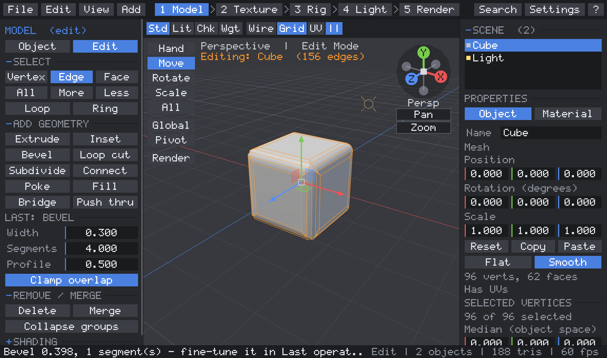

*Model workspace in Edit mode: every edge selected, `Ctrl+B`, then Width 0.3 and Segments 4 typed into
the Last operation panel.*

### Push through

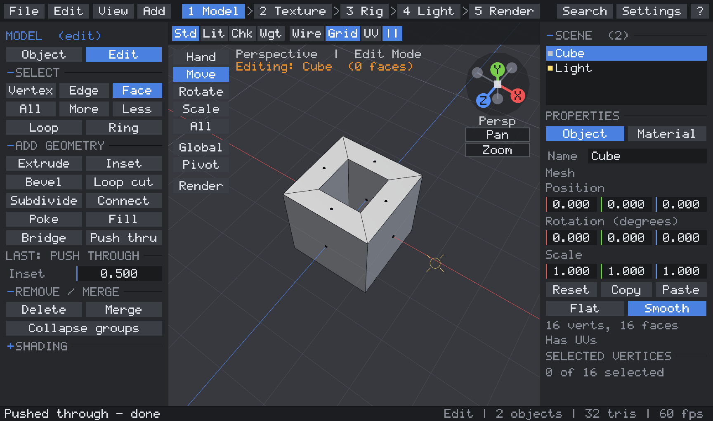

*The top face pushed through with Inset 0.5: a frame, a hole on both sides and a tunnel between them.*

### Command palette

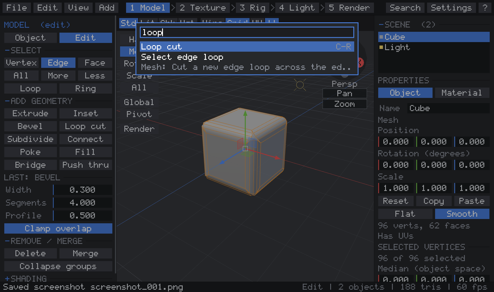

*`Ctrl+K` (or `Shift+Space`): every command by name, with its shortcut, for keyboard-only use.*

### Texture workspace and Settings

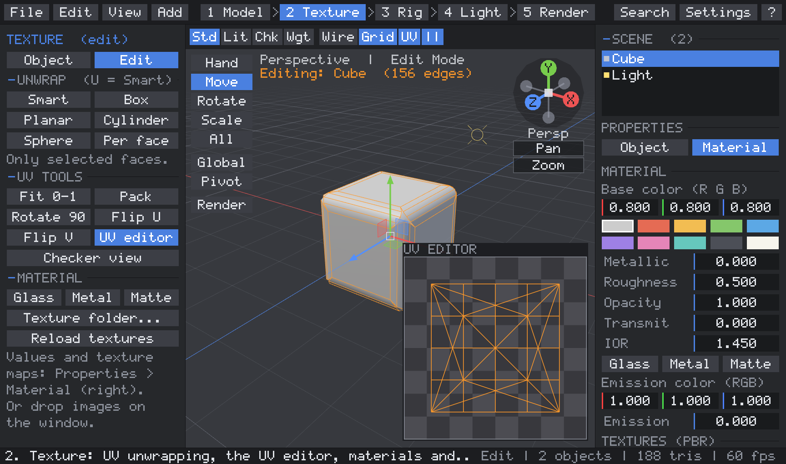

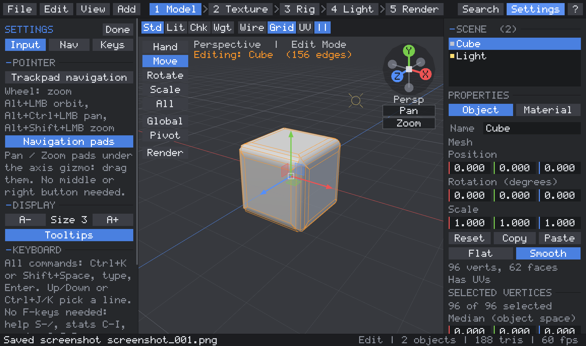

### Materials, render camera and area light

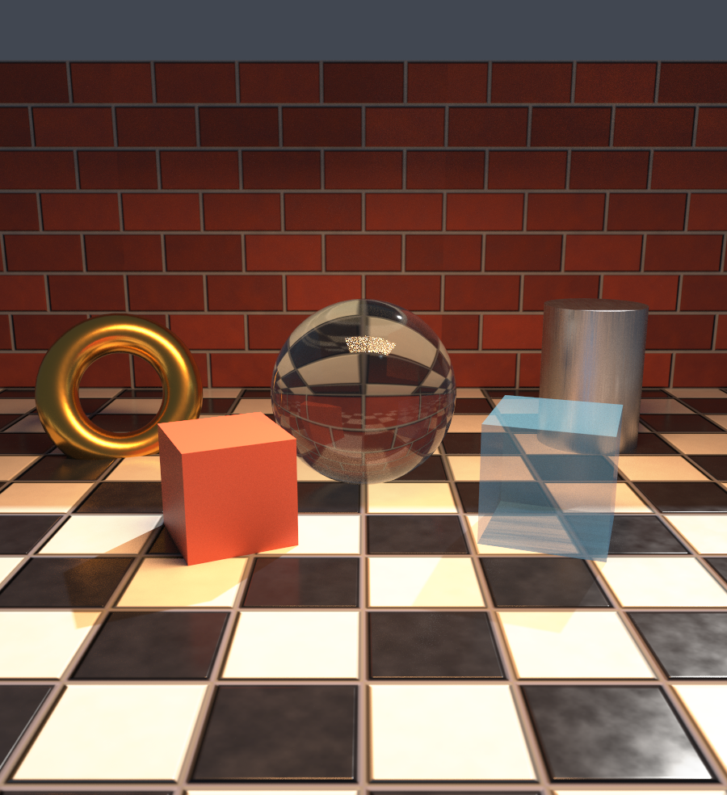

*`Modeler3D --demo 6`, 1024 samples on the GPU: PBR texture sets on the floor and wall, a glass ball,
gold and brushed steel, a see-through cube, a 3200 K area light and a 6500 K sun, through a 40 mm
camera at f/2 with depth of field.*

### Inset and face selection

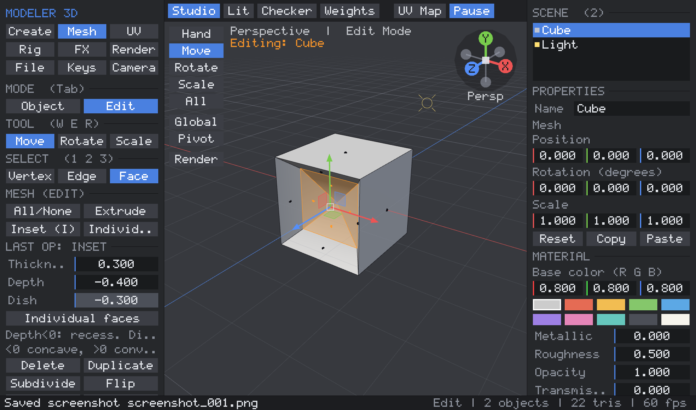

*Face mode with an inset: the Last op panel's Width, Depth and Dish fields accept typed values.*

### PBR texture slots

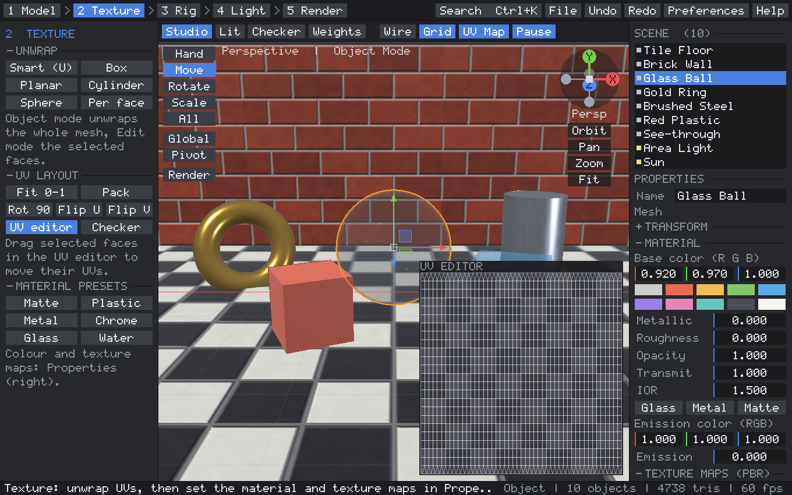

### Path tracing

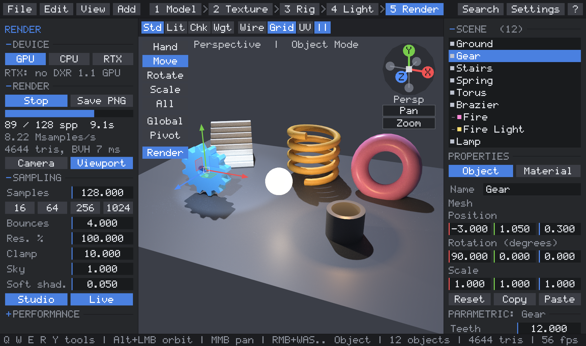

*`Modeler3D --demo 1`, Render workspace (`Alt+5`): GPU path tracing with soft shadows, glossy reflections and the glowing
lamp lighting the floor. The panel shows progress, samples/s and the sampling settings.*

### Booleans

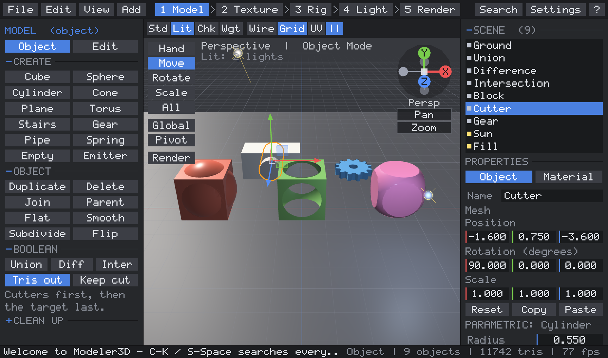

*`Modeler3D --demo 5`: a cube and a sphere combined by union, difference and intersection, and a
block with a cylinder cutter to try it yourself. The Mesh tab has the Boolean and N-gon solver tools.*

### Key bindings

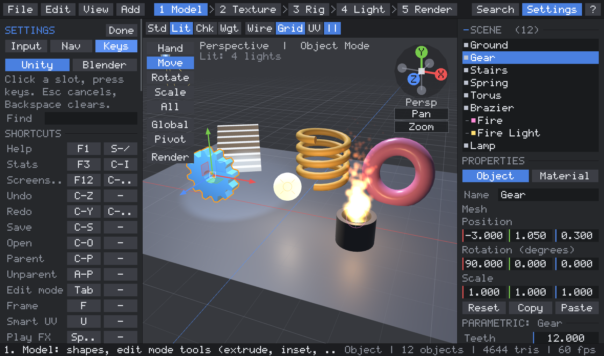

### Unity-style transform handles

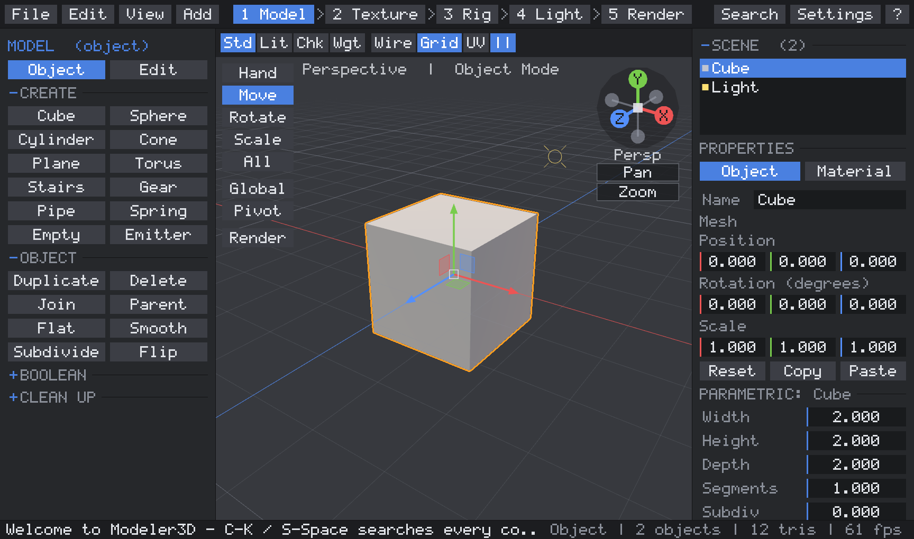

*Default scene: the Move handle (arrows, plane squares, centre box), the orange selection outline,
and the tool palette.*

### UV editor

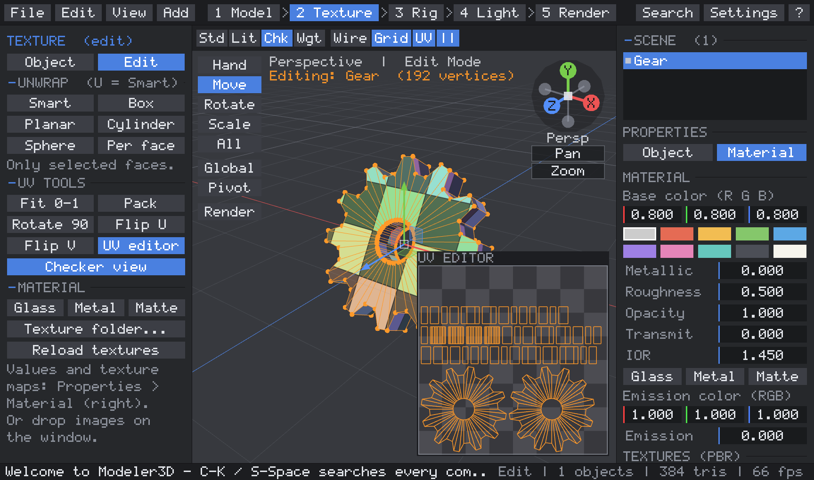

*`Modeler3D --demo 3`: Smart unwrap of a gear. The checker view on the model and the packed layout
in the UV editor (selected faces in orange).*

### Skinned mesh

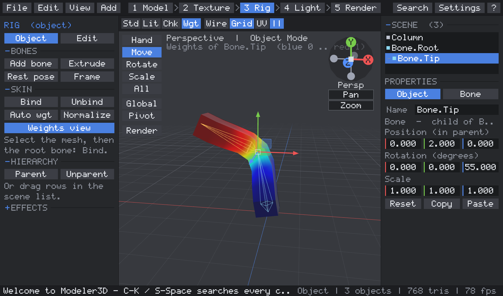

*`Modeler3D --demo 4`: a column skinned to two bones and bent by posing the tip bone. The Weights
view shows that bone's influence (blue 0 to red 1).*

## Performance

See [docs/performance.md](docs/performance.md) for the benchmark method, before/after numbers and the
bottlenecks that were fixed. For example, 1000 objects went from 187 ms to 12 ms per frame, and
loading a 131k-quad scene from 4.5 s to 0.13 s. The report also compares 1 thread with all threads and
CPU with GPU path tracing. On the test laptop (Intel Iris Xe, 12 threads), the GPU path traces about 7x
faster than all 12 CPU threads, and the CPU tracer scales about 5x from 1 to 12 threads. Round 6 added a
picking BVH (edit-mode picking on a 262k-triangle mesh about 2500x faster) and a 3x faster JPEG decoder.
Run it yourself with `Modeler3D --benchmark report.md`.

Round 7 measured the previous version and this one back to back: 1000 objects and dragging every
vertex of a 262k-triangle mesh are now about 2x faster, posing a skinned mesh 2x. The **stress test**
(`Modeler3D --stress report.md`, [docs/stress-report.md](docs/stress-report.md)) pushes every limit:
meshes up to 4.1 million triangles (still above 30 fps when idle), 50,000 objects (360 MB instead of 5 GB),
parent chains 50,000 deep, 6,000 random modeling operations, 3,000 frames of random input and every
window size from 320x240 to 4K. It found and drove the fixes for an O(n^3) naming bug, a boolean that ran
out of memory, non-manifold results of several tools on unusual selections, and more - see
[docs/performance.md](docs/performance.md#round-7-stress-testing).

## Building from source

**Windows:** run `build_windows.bat`. It uses CLion's bundled MinGW / CMake / Ninja if CLion is
installed, or any CMake + MinGW-w64 / Visual Studio on the PATH. The result is
`dist\windows\Modeler3D.exe`, statically linked so it only depends on DLLs that ship with Windows.
The project also opens directly in CLion (`CMakeLists.txt`); pick the `Modeler3D` target.

**Linux:** install a compiler, CMake and the X11/OpenGL headers
(`sudo apt install build-essential cmake libx11-dev libgl-dev` on Debian/Ubuntu), then run
`./build_linux.sh`. The result is `dist/linux/Modeler3D`.

**Tests:** configure with `-DMODELER_BUILD_TESTS=ON` and run `modeler_tests`. Its 1984 checks
(1980 on Linux, where the DXR test is skipped) cover:
- math and TRS decomposition
- primitives and all 10 parametric shapes (closed, consistently oriented, outward-facing)
- Catmull-Clark (including UVs and weights), extrude / delete
- every UV unwrap method and island packing
- hierarchy (world matrices, keep-world parenting, cycle refusal)
- skinning (rest pose is exact, bending moves the right vertices)
- particles, ray picking, and `.m3d` / OBJ round trips
- the Unity-style Transform API, the id cache, ray/box rejection and indexed render data
- the job system, on 1 thread and on many, including nested parallel loops
- the n-gon solver: concave and star polygons, T-junction repair, welding, tri/quad round trips
- booleans: exact volumes for union, difference and intersection, results closed and consistently
  oriented, coplanar faces, a cavity, and a curved cut
- the BVH (against brute force, and parallel against serial builds), and the path tracer's lighting,
  shadows, emission and progressive renderer
- key bindings: parsing, presets without conflicts, rebinding and config round trips
- the round-7 tools with exact volumes: loop cut, subdivide, connect, poke, bevel (one edge, all 12
  edges of a cube, rounded, a corner), bridge (loops and face groups), fill, merge, push through
  (with a frame and through two matching insets, genus checked), join with a mirror transform
- position-only render refresh equals a full rebuild; hierarchies deeper than the old 256 limit;
  parallel scene saving round-trips exactly; F-key-free bindings in both keymaps
- 23 failures found by the stress test's fuzzer, replayed from `tests/data/fuzz` (each must now give a
  valid mesh that stays closed), and the boolean that ran out of memory

`M3D_REPLAY=tests/data/fuzz/fuzz_fail_02 modeler_tests` replays one case; `M3D_FUZZ_TRACE=1
Modeler3D --stress r.md --stress-only D` dumps new ones.
- the expression parser for typed values, edge extrusion and face inset (closed results, exact
  volumes), picking BVH against brute force, hierarchy drag and drop (including refused cycles)
- image decoders against reference PNGs (every color type and bit depth, Adam7) and JPEGs, the
  inflate decoder, and the texture cache
- color temperature, camera exposure, area lights, glass and transparency in the CPU tracer, `.m3d`
  and MTL round trips of the new material data, and the DXR tracer against the CPU tracer (on Windows,
  using WARP when no DXR GPU is present)

## How the code maps to the Engine Books

| Topic | Code | Reference |
|---|---|---|
| Vectors, matrices, TRS transforms / decomposition, Euler angles | `src/math3d.h` | *Fundamentals of Computer Graphics* 5e ch. 2, 6, 7; *Game Engine Architecture* Vol. I ch. 5 |
| Camera, perspective / orthographic projection | `Camera` in `editor.cpp` | FoCG ch. 8 |
| Ray picking (unproject + ray/triangle) | `Editor::viewRay`, `raycastMesh`, `pickObject` | FoCG ch. 4 |
| Point / sun / spot lights, Blinn-Phong, ambient, emission | shaders in `renderer.cpp` | FoCG ch. 5; GEA Vol. II ch. 12 (12.4 shading equation, 12.5 lighting with rasterization) |
| GPU pipeline, vertex buffers, per-object mesh cache, point sprites | `renderer.cpp` | FoCG ch. 9, 17; GEA Vol. II sec. 11.4 |
| UV mapping, unwrapping, checker texture | `uv.cpp`, `renderer.cpp` | FoCG ch. 11 (texture mapping) |
| Indexed polygon meshes, subdivision, extrude | `mesh.cpp` | FoCG sec. 12.1 |
| Transform hierarchy / scene graph | `Scene::world`, `setParent` in `scene.cpp` | FoCG sec. 12.2; GEA Vol. II sec. 13.2 |
| Skeletons, poses, linear-blend skinning, matrix palette | `skin.cpp` | GEA Vol. II sec. 13.2-13.5 |
| Particle systems | `particles.cpp` | FoCG sec. 16.7; GEA Vol. II sec. 11.6, 14.4 (integration) |
| Parametric / procedural shapes, data-driven recipes | `parametric.cpp` | FoCG sec. 16.6; GEA Vol. II sec. 16.3 |
| Scene / object model, world editor | `scene.cpp`, `editor*.cpp` | GEA Vol. II ch. 16 (game world editor) |
| Unity-style Transform API, handles (ray-plane dragging) | `transform.cpp`, `editor_gizmo.cpp` | FoCG ch. 4, 7; GEA Vol. I sec. 5.3 |
| Profiler, benchmark, F3 overlay | `profiler.cpp`, `editor_bench.cpp` | GEA Vol. I sec. 2.3, ch. 10 |
| Platform layer (Win32/WGL, X11/GLX) | `platform_*.cpp` | GEA Vol. I sec. 1.5 |
| Input: per-frame pressed / held / released state | `platform.h` | GEA Vol. I ch. 9 (Human Interface Devices) |
| Main loop, startup / shutdown order, frame timing | `main.cpp` | GEA Vol. I sec. 6.1, ch. 8 |
| Immediate-mode UI, in-tool menus, debug overlays | `ui.cpp`, `editor_ui.cpp` | GEA Vol. I ch. 10; GEA Vol. II sec. 12.8 |
| Asset I/O (scene + OBJ) | `scene.cpp` | GEA Vol. I ch. 7 |
| Boolean operations with BSP trees | `csg.cpp` | FoCG sec. 12.4 (BSP trees) |
| Polygon triangulation (ear clipping), mesh clean-up | `polygon.cpp` | FoCG sec. 12.1 |
| Bounding volume hierarchy (binned SAH) | `bvh.cpp` | FoCG sec. 12.3 (spatial data structures) |
| Path tracing, Monte Carlo sampling | `pathtracer.cpp`, `gpu_tracer.cpp` | FoCG ch. 4 (ray tracing), ch. 13 (sampling), sec. 14.10 (Monte Carlo ray tracing) |
| Job system / thread pool, parallel loops | `jobs.cpp` | GEA Vol. I ch. 4 (parallelism and concurrency), sec. 8.6 |
| Input re-mapping, context-sensitive controls | `input_map.cpp` | GEA Vol. I sec. 9.5 (game engine HID systems) |
| GPU timer queries, in-game profiling | `gpu_tracer.cpp` (`GpuTimer`) | GEA Vol. I sec. 10.8 |
| Bevel, loop cut, bridge, push through (polygon mesh topology) | `meshtools.cpp` | FoCG sec. 12.1 |
| Pool allocation of GPU buffers (sub-allocated ranges) | `Renderer::poolUpload` | GEA Vol. I sec. 6.2 (memory management, pool allocators) |
| Commands, menus, palette (one action table for UI and input) | `editor_commands.cpp` | GEA Vol. I sec. 9.5 (input re-mapping), ch. 10 (in-game menus) |
| Stress / fuzz testing | `editor_stress.cpp` | GEA Vol. I ch. 2 (tools of the trade), ch. 10 (debugging) |
| Microfacet BRDF (GGX), Fresnel, refraction, glass | `pathtracer.cpp`, `hwrt.hlsl` | FoCG sec. 4.8 (refraction), ch. 14 (physics-based rendering) |
| Thin-lens camera, depth of field | `rt::primaryRay` in `pathtracer.cpp` | FoCG sec. 13.4.3 (depth of field) |
| Area lights, soft shadows | `pathtracer.cpp` | FoCG sec. 13.4.2, 14.4 |
| Texture mapping, normal maps, mipmaps | `renderer.cpp`, `image_load.cpp` | FoCG ch. 11; GEA Vol. II sec. 11.2 |
| Hardware ray tracing (DXR), acceleration structures | `hwrt.cpp`, `shaders/hwrt.hlsl` | GEA Vol. II sec. 11.4 (GPU pipeline); FoCG sec. 12.3 |
| Mesh topology edits (edge extrude, inset) | `meshedit.cpp` | FoCG sec. 12.1 |

## Project layout

```
CMakeLists.txt        build definition (Windows: WIN32 GUI exe, static runtime; Linux: X11 + libGL)
build_windows.bat     one-click Windows build -> dist/windows/
build_linux.sh        one-command Linux build -> dist/linux/
src/
  main.cpp            entry point + main loop
  platform.h          window/input abstraction; platform_win32.cpp, platform_x11.cpp
  gl.h / gl.cpp       minimal OpenGL 3.3 function loader (no GLAD/GLEW)
  math3d.h            vector/matrix math
  mesh.*              mesh data (+UVs, bone weights), primitives, Catmull-Clark, extrude, ray casting
  uv.*                UV unwrapping, island packing, UV tools
  parametric.*        parametric shapes and the modifier stack
  scene.*             objects, hierarchy, lights, picking, .m3d and .obj file I/O
  skin.*              bones, binding, automatic weights, skinning
  particles.*         particle simulation
  renderer.*          shaders, lights, GPU buffers, drawing
  ui.*, font.*        immediate-mode GUI + built-in bitmap font
  editor.*            the application: frame loop, input, transform tool, undo
  editor_actions.cpp  commands (create, mesh/UV/rig tools, hierarchy, files, sample scenes)
  editor_ui.cpp       panels, outliner, properties, UV editor, dialogs
  editor_render.cpp   viewport drawing, selection outline, icons, particles
  editor_gizmo.cpp    Unity-style Move / Rotate / Scale handles, keymap settings
  editor_bench.cpp    --benchmark scenarios and report
  editor_meshops.cpp  Boolean and n-gon solver commands
  editor_renderview.cpp  path-traced viewport, render settings, GPU reporting
  editor_commands.cpp command registry, workspaces, command palette, top bar menus, Settings page
  editor_props.cpp    scene outliner (drag & drop) and the Properties tabs
  editor_tools.cpp    edit-mode tools on meshtools: bevel, loop cut, bridge, push through, merge, join
  editor_stress.cpp   --stress: mesh / object / hierarchy limits, tool and input fuzzing, layout extremes
  meshtools.*         subdivide / loop cut / connect / poke / bevel / bridge / fill / push through / merge
  jobs.*              job system (thread pool, parallel-for, task groups)
  polygon.*           n-gon solver: ear-clipping triangulation, weld / T-junction clean-up, tris->quads
  csg.*               BSP-tree boolean operations
  bvh.*               bounding volume hierarchy for ray tracing
  pathtracer.*        render scene build, path tracing, progressive multithreaded CPU renderer
  gpu_tracer.*        GLSL path tracer, float accumulation, GPU timer queries
  input_map.*         rebindable actions, Unity / Blender presets, config format
  transform.*         Unity-style Transform API (world get/set, Translate, Rotate, LookAt...)
  profiler.*          scoped CPU profiler (F3 overlay, benchmark)
  image_io.*          PNG writer with its own DEFLATE compressor
  image_load.*        PNG / JPEG / TGA / BMP decoders, inflate, texture cache, built-in texture sets
  expr.*              expression parser for typed values
  meshedit.*          edge / face selection conversion, edge extrude, inset
  editor_editmode.cpp vertex / edge / face selection, picking, inset tool
  hwrt.*              DXR 1.1 hardware ray tracer (Direct3D 12, loaded at run time; stub on Linux)
  shaders/hwrt.hlsl   the DXR tracer's compute shader; hwrt_shader.inl is its compiled DXIL
tools/compile_hwrt_shader.py  recompiles hwrt.hlsl with dxc from the Windows SDK
docs/                 screenshots, performance.md, benchmark-report.md
tests/tests.cpp       unit tests (+ tests_round5-7.inc, data/ test images)
```

Sample scenes for a quick tour: `Modeler3D --demo 1` (showcase), `--demo 3` (UVs), `--demo 4` (rig),
`--demo 5` (booleans), `--demo 6` (materials, area light and render camera).
