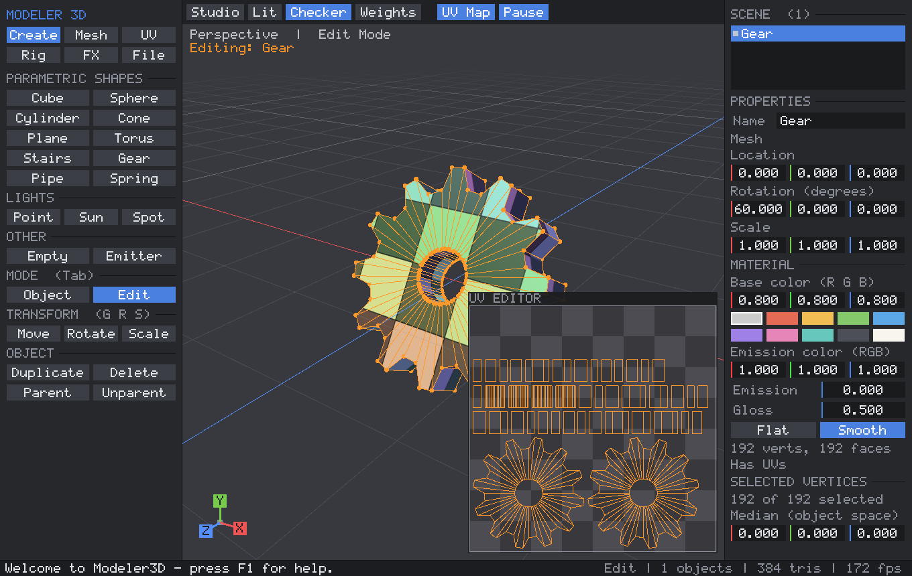
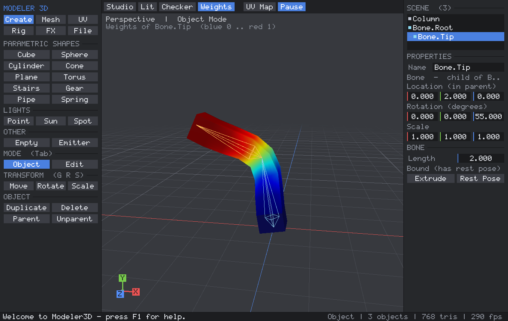

# Modeler3D

A small 3D modeling program written in C++17 and OpenGL 3.3. It runs on Windows and Linux,
has **no third-party dependencies**, and builds into a single executable you can just run.


| UV unwrapping + UV editor | Bones, skinning and weights |
|---|---|
|  |  |

## Run it

| OS      | File                         | How                                              |
|---------|------------------------------|--------------------------------------------------|
| Windows | `dist/windows/Modeler3D.exe` | Double-click it. No installer, no DLLs.          |
| Linux   | `dist/linux/Modeler3D`       | `./Modeler3D` (needs X11 + an OpenGL 3.3 driver). |

You can also pass a file to open: `Modeler3D chair.m3d` or `Modeler3D model.obj`.

> The prebuilt Linux binary was built on Ubuntu 26.04, so it needs a recent glibc (2.43+).
> On older distributions, build it yourself with `./build_linux.sh`. It takes about 20 seconds.

## What it can do

**Modeling**
- **Parametric shapes**: cube, sphere, cylinder, cone/frustum, plane, torus, stairs, gear, pipe and
  spring. Every shape keeps its recipe, so you can change radius, segments, teeth, coils and so on at
  any time, plus a non-destructive modifier stack (subdivision levels, twist, taper). *Bake* turns the
  shape into a plain mesh; entering Edit mode bakes automatically (undo restores the recipe).
- **Object mode**: select (click, Shift+click, box), move / rotate / scale with axis locks and
  snapping, duplicate, delete, rename, and numeric location / rotation / scale.
- **Edit mode** (vertices): select, move / rotate / scale, **extrude** faces, delete, edit the
  median numerically. **Catmull-Clark subdivision** and **flip normals**.

**Hierarchy**
- Parent objects to each other (`Ctrl+P`, the last-clicked object becomes the parent) or clear the
  parent (`Alt+P`). Both keep each object where it is in the world.
- Children follow their parents: lights stuck to lamps, effects stuck to bones, groups under an
  **Empty**. The outliner shows the tree, and the viewport draws relationship lines.
- Deleting a parent hands its children to the grandparent. Duplicating keeps the links, and
  duplicating a whole rig remaps it to the copies.

**Lighting and materials**
- **Point, sun and spot lights** with color, intensity, range, cone angle and edge blend, plus a
  scene **ambient** color. Up to 8 lights are used in the **Lit** view.
- Materials have base color, **emission** (color + strength, glows in every view) and gloss.

**UVs**
- **Unwrap**: *Smart* (charts by face direction, packed without overlap), *Box*, *Planar*,
  *Cylindrical*, *Spherical*, *Per-face* (lightmap style). In Object mode it unwraps whole meshes;
  in Edit mode, only the selected faces.
- **Tools**: fit to 0-1, pack islands, rotate 90, flip U / V.
- A **UV editor** overlay shows the layout; drag selected faces in it to move their UVs.
- A **checker** view shows stretching and seams.
- UVs are stored per face corner, survive subdivision / extrude, and round-trip through `.m3d`
  and OBJ (`vt`).

**Bones and skinning**
- **Bones** are hierarchy objects: *Add Bone*, then *Extrude* to grow a chain from the tip.
- **Bind**: select the mesh and the root bone, then bind. The bind pose becomes the rest pose and
  weights are computed automatically (up to 4 bones per vertex).
- Pose by rotating bones (`R`). *Rest Pose* resets them.
- **Weights view** is a heat map of one bone's influence (select a bone, or pick it in
  Properties > Skin). In Edit mode you can **assign / remove** a weight on the selected vertices,
  **normalize**, or recompute automatic weights.

**Particles**
- **Emitters** with rate, lifetime, speed, spread cone, gravity, drag, start/end size and
  color, and spawn radius. *Glow* blends additively; *Smoke* is alpha-blended.
- They simulate live (Space plays / pauses) and are hierarchy objects, so you can parent fire to a
  torch or sparks to a bone.

**Everything else**
- **Undo / redo** (64 steps) covers every edit.
- **Save / load** `.m3d` scenes, and **export / import Wavefront OBJ** (+ `.mtl` with colors,
  emission and gloss). Exports bake transforms and the current pose.
- Shading modes **Studio / Lit / Checker / Weights** (`Z` cycles them).
- Also: perspective / ortho, front / right / top views, wireframe, grid, orientation gizmo,
  F12 PNG screenshots, and a warning before quitting with unsaved changes.

## Controls

| Input                          | Action                                               |
|--------------------------------|------------------------------------------------------|
| Left click / drag              | Select / box select (Shift adds, Ctrl removes)       |
| Right or middle drag           | Orbit camera (also Alt + left drag)                  |
| Shift + right drag             | Pan camera                                           |
| Wheel                          | Zoom                                                 |
| `G` / `R` / `S`                | Move / rotate / scale. Then `X` `Y` `Z` locks an axis and holding `Ctrl` snaps. Click or Enter confirms; right click or Esc cancels |
| `Tab`                          | Toggle Object / Edit mode                            |
| `A` / `E` / `X`                | Select all / extrude faces / delete                  |
| `Shift+D`                      | Duplicate                                            |
| `Ctrl+P` / `Alt+P`             | Parent to the active object / clear parent           |
| `U`                            | Smart UV unwrap                                      |
| `Z`                            | Cycle shading: Studio, Lit, Checker, Weights         |
| `Space`                        | Play / pause particles                               |
| `F`                            | Frame selection                                      |
| `1` `3` `7` (Ctrl = opposite)  | Front / right / top view                             |
| `5` / `W`                      | Perspective-orthographic / wireframe + x-ray picking |
| `Ctrl+Z` / `Ctrl+Y`            | Undo / redo                                          |
| `Ctrl+S` / `Ctrl+O`            | Save / load the file named in the File tab           |
| `F12`                          | Save a PNG screenshot                                |
| `F1` / `H`                     | Help overlay                                         |

The left panel has tabs: **Create, Mesh, UV, Rig, FX, File**. To change a number in the right
panel, drag it sideways (hold Shift for fine steps) or click it and type a value.

## Building from source

**Windows:** run `build_windows.bat`. It uses CLion's bundled MinGW / CMake / Ninja if CLion is
installed, or any CMake + MinGW-w64 / Visual Studio on the PATH. The result is
`dist\windows\Modeler3D.exe`, statically linked so it only depends on DLLs that ship with Windows.
The project also opens directly in CLion (`CMakeLists.txt`); pick the `Modeler3D` target.

**Linux:** install a compiler, CMake and the X11/OpenGL headers
(`sudo apt install build-essential cmake libx11-dev libgl-dev` on Debian/Ubuntu), then run
`./build_linux.sh`. The result is `dist/linux/Modeler3D`.

**Tests:** configure with `-DMODELER_BUILD_TESTS=ON` and run `modeler_tests`. Its 948 checks cover:
- math and TRS decomposition
- primitives and all 10 parametric shapes (closed, consistently oriented, outward-facing)
- Catmull-Clark (including UVs and weights), extrude / delete
- every UV unwrap method and island packing
- hierarchy (world matrices, keep-world parenting, cycle refusal)
- skinning (rest pose is exact, bending moves the right vertices)
- particles, ray picking, and `.m3d` / OBJ round trips

## How the code maps to the Engine Books

| Topic | Code | Reference |
|---|---|---|
| Vectors, matrices, TRS transforms / decomposition, Euler angles | `src/math3d.h` | *Fundamentals of Computer Graphics* 5e ch. 2, 6, 7; *Game Engine Architecture* Vol. I ch. 5 |
| Camera, perspective / orthographic projection | `Camera` in `editor.cpp` | FoCG ch. 8 |
| Ray picking (unproject + ray/triangle) | `Editor::viewRay`, `raycastMesh`, `pickObject` | FoCG ch. 4 |
| Point / sun / spot lights, Blinn-Phong, ambient, emission | shaders in `renderer.cpp` | FoCG ch. 5; GEA Vol. II ch. 12 (12.4 shading equation, 12.5 lighting with rasterization) |
| GPU pipeline, vertex buffers, per-object mesh cache, point sprites | `renderer.cpp` | FoCG ch. 9, 17; GEA Vol. II sec. 11.4 |
| UV mapping, unwrapping, checker texture | `uv.cpp`, `renderer.cpp` | FoCG ch. 11 (texture mapping) |
| Indexed polygon meshes, subdivision, extrude | `mesh.cpp` | FoCG sec. 12.1 |
| Transform hierarchy / scene graph | `Scene::world`, `setParent` in `scene.cpp` | FoCG sec. 12.2; GEA Vol. II sec. 13.2 |
| Skeletons, poses, linear-blend skinning, matrix palette | `skin.cpp` | GEA Vol. II sec. 13.2-13.5 |
| Particle systems | `particles.cpp` | FoCG sec. 16.7; GEA Vol. II sec. 11.6, 14.4 (integration) |
| Parametric / procedural shapes, data-driven recipes | `parametric.cpp` | FoCG sec. 16.6; GEA Vol. II sec. 16.3 |
| Scene / object model, world editor | `scene.cpp`, `editor*.cpp` | GEA Vol. II ch. 16 (game world editor) |
| Platform layer (Win32/WGL, X11/GLX) | `platform_*.cpp` | GEA Vol. I sec. 1.5 |
| Input: per-frame pressed / held / released state | `platform.h` | GEA Vol. I ch. 9 (Human Interface Devices) |
| Main loop, startup / shutdown order, frame timing | `main.cpp` | GEA Vol. I sec. 6.1, ch. 8 |
| Immediate-mode UI, in-tool menus, debug overlays | `ui.cpp`, `editor_ui.cpp` | GEA Vol. I ch. 10; GEA Vol. II sec. 12.8 |
| Asset I/O (scene + OBJ) | `scene.cpp` | GEA Vol. I ch. 7 |

## Project layout

```
CMakeLists.txt        build definition (Windows: WIN32 GUI exe, static runtime; Linux: X11 + libGL)
build_windows.bat     one-click Windows build -> dist/windows/
build_linux.sh        one-command Linux build -> dist/linux/
src/
  main.cpp            entry point + main loop
  platform.h          window/input abstraction; platform_win32.cpp, platform_x11.cpp
  gl.h / gl.cpp       minimal OpenGL 3.3 function loader (no GLAD/GLEW)
  math3d.h            vector/matrix math
  mesh.*              mesh data (+UVs, bone weights), primitives, Catmull-Clark, extrude, ray casting
  uv.*                UV unwrapping, island packing, UV tools
  parametric.*        parametric shapes and the modifier stack
  scene.*             objects, hierarchy, lights, picking, .m3d and .obj file I/O
  skin.*              bones, binding, automatic weights, skinning
  particles.*         particle simulation
  renderer.*          shaders, lights, GPU buffers, drawing
  ui.*, font.*        immediate-mode GUI + built-in bitmap font
  editor.*            the application: frame loop, input, transform tool, undo
  editor_actions.cpp  commands (create, mesh/UV/rig tools, hierarchy, files, sample scenes)
  editor_ui.cpp       panels, outliner, properties, UV editor, dialogs
  editor_render.cpp   viewport drawing, gizmos, particles
  image_io.*          PNG writer for screenshots
tests/tests.cpp       unit tests
```

Sample scenes for a quick tour: `Modeler3D --demo 1` (showcase), `--demo 3` (UVs), `--demo 4` (rig).
